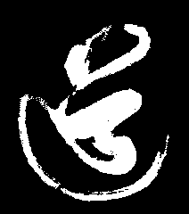

# 章节概要

在本章里, 阿凯给大家介绍了常用的二值形态学运算 : 腐蚀, 膨胀, 开运算, 闭运算. 并结合各自的特点, 类比为持有不同扩张策略的国君/国家.类比如有不恰之处，请指正。

## 什么是数学形态学?

关于数学形态学, 维基百科上有对应的定义:

> **数学形态学（Mathematical morphology）** 是一门建立在[格论](https://zh.wikipedia.org/wiki/%E6%A0%BC%E8%AE%BA)和[拓扑学](https://zh.wikipedia.org/wiki/%E6%8B%93%E6%89%91%E5%AD%A6)基础之上的图像分析学科，是数学形态学[图像处理](https://zh.wikipedia.org/wiki/%E5%9B%BE%E5%83%8F%E5%A4%84%E7%90%86)的基本理论。其基本的运算包括：[腐蚀](https://zh.wikipedia.org/wiki/%E8%85%90%E8%9A%80_(%E5%BD%A2%E6%80%81%E5%AD%A6))和[膨胀](https://zh.wikipedia.org/wiki/%E8%86%A8%E8%83%80_(%E5%BD%A2%E6%80%81%E5%AD%A6))、[开运算](https://zh.wikipedia.org/wiki/%E5%BC%80%E8%BF%90%E7%AE%97_(%E5%BD%A2%E6%80%81%E5%AD%A6))和[闭运算](https://zh.wikipedia.org/wiki/%E9%97%AD%E8%BF%90%E7%AE%97_(%E5%BD%A2%E6%80%81%E5%AD%A6))、骨架抽取、极限腐蚀、击中击不中变换、形态学梯度、Top-hat变换、颗粒分析、流域变换等。
>
> [wiki-数学形态学](https://zh.wikipedia.org/wiki/%E6%95%B0%E5%AD%A6%E5%BD%A2%E6%80%81%E5%AD%A6)

首先呢, **数学形态学**并不是什么高大上的概念. 数学形态学两个最基本的操作是**腐蚀** 跟**膨胀**. 利用数学形态学, 我们可以实现如下操作:

1. **数学形态学滤波**, 去除图像中的噪点.
2. **连通域分割**, 将原来连通在一起的区域, 分离为两个独立的连通域.
3. **连通域拼接** 将两个独立的连通域拼接为一个连通域.
4. **提取图像轮廓** 
5. **突出图像中亮斑或者暗斑**

本次课程, 阿凯要介绍的二值形态学操作有:

* 腐蚀 **erode**
* 膨胀 **dilate**
* 开运算 **opening**
* 闭运算 **closing**
* 数学形态学梯度 **gradient**

接下来我们一个个介绍.

我们会使用这张二值化图片进行演示二值形态学的各种图片.

>  上图截取自一位陈姓道士的墨宝

## 参考文献 Reference

[形态学滤波](https://www.jianshu.com/p/a3d899bd99ee)

[Morphological Transformations-opencv官方文档](https://docs.opencv.org/3.0-beta/doc/py_tutorials/py_imgproc/py_morphological_ops/py_morphological_ops.html)

[morphological-transformation-python-opencv-tutorial](https://pythonprogramming.net/morphological-transformation-python-opencv-tutorial/)

[OpenCV-Python教程（4、形态学处理）](http://blog.csdn.net/sunny2038/article/details/9137759)
